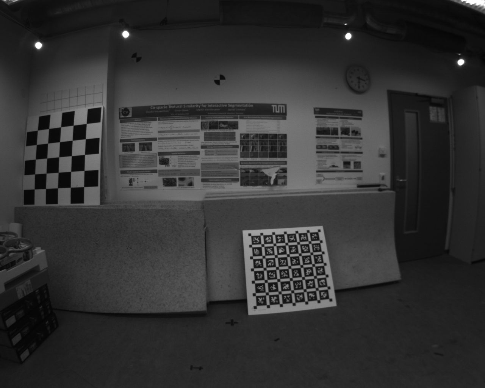

FieldFixer takes the fancy NeRF research ideas and turns them into boring little sidecar files so a normal CPU can fix a video. The repo ships the CLI (`fieldfixer bake` and `fieldfixer apply`), plus a stub bake that you can swap out for the real RS-NeRF / Deblur-NeRF / RawNeRF work when you are ready.

Below is what the rolling-shutter dataset looks like before and after we line up cam1 (RS) with cam0 (GS). No training, just the same sidecar format we use for the NeRF modules.

**Rolling shutter input (cam1)**

**Global shutter reference (cam0)**

References:
- RS-NeRF / URS-NeRF (rolling shutter timing) � https://arxiv.org/abs/2404.07488 and https://arxiv.org/abs/2407.01242
- Deblur-NeRF (sharp targets from blur) � https://openaccess.thecvf.com/content/CVPR2022/html/Chen_Deblur-NeRF_Deblurring_Neural_Radiance_Fields_With_Cameras_On_Motion_CVPR_2022_paper.html
- RawNeRF / NeRF-in-the-Dark (RAW/HDR) � https://openaccess.thecvf.com/content/CVPR2022/html/Mildenhall_RawNeRF_A_Raw_Neural_Radiance_Field_for_HDR_Imaging_CVPR_2022_paper.html
- NeRF-W (appearance embeddings, LUT fit) � https://openaccess.thecvf.com/content/CVPR2021/html/Martin-Brualla_NeRF_in_the_Wild_Neural_Radiance_Fields_for_Unconstrained_Photos_CVPR_2021_paper.html
